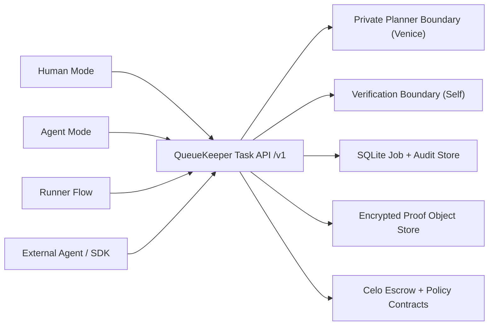

# QueueKeeper

QueueKeeper is a testnet-first private scout-and-hold procurement product: a human or agent principal can post a redacted task, reveal the exact destination only after verified acceptance, and pay only for the next verified increment instead of the whole promise.

Live site:
- `https://queuekeeper.xyz`

## Why this business model matters

QueueKeeper is not just "pay someone to wait in line." It defines a different trust model for real-world service work:

- the provider never has to risk delivering the entire service before getting paid
- the buyer never has to risk paying for the entire promise up front
- at any point in time, each side is only exposed to the next increment:
  - the runner can lose only the next increment of service
  - the buyer can lose only the next increment of payment

That is the core business model. The trust boundary is reduced from "trust the whole engagement" to "trust the next small verified step."

This only works because QueueKeeper is built around cheap, fast, frequent micropayments:

- scout
- arrival
- repeated heartbeat
- completion

Traditional payment rails like credit cards are too coarse for this pattern:

- they are not designed for frequent low-value releases tied to live proof checkpoints
- settlement is too slow and operationally heavy
- fees and dispute mechanics are built for larger, infrequent payments
- they do not naturally expose machine-readable receipt state for each service increment

QueueKeeper uses micropayments not as a gimmick, but because they make this trust-minimized service model possible.

## Sponsor rails and why they matter

Each sponsor rail strengthens a specific part of the product instead of sitting beside it as a disconnected demo.

- Protocol Labs / ERC-8004
  - makes the agent a visible economic actor with public identity, `agent.json`, and `agent_log.json`
  - helps judges and other agents inspect what the system is, what it can do, and how it acted
- Venice
  - keeps hidden task details inside the private planner boundary
  - lets the product reason over sensitive destination and fallback context without leaking it into public task payloads
- MetaMask
  - binds spend to a task-scoped policy instead of giving the agent uncapped wallet power
  - keeps cap, expiry, token, contract, and task binding explicit in the product
- Self
  - blocks acceptance until the runner clears a verification gate
  - makes reveal gating load-bearing instead of trusting any wallet to unlock the exact destination
- Celo
  - provides the cheap, quick micropayment rail that makes staged service increments economically practical
  - makes the runner flow mobile-friendly and the payout ladder believable
- Uniswap
  - normalizes the buyer budget into the right payout asset before the task starts
  - turns treasury preparation into a real in-product rail instead of an off-screen assumption
- Base / x402
  - sells one paid venue hint and writes the receipt back into the task log
  - shows that agents can buy external signals during the task loop and use them in the next decision
- Arkhai
  - maps cleanly onto the product's staged obligation model: repeated checkpoints, releases, disputes, and settlement
  - reinforces that the trust boundary is structured as explicit obligations, not informal promises

## What is real now

- A durable core product layer lives in `packages/core`:
  - SQLite-backed job state and audit trail
  - encrypted secret payload storage
  - encrypted proof bundle storage
  - repeated heartbeat stages
  - timeout-based auto-release
  - dispute freeze and settlement
  - expiry refunds
  - idempotent draft creation
- A typed SDK lives in `packages/sdk`.
- `apps/agent` now exposes a real `/v1` headless API on top of the same core.
- `apps/web` exposes the same `/api/v1` API locally and uses the same planner/verification boundaries.
- Human Mode and Agent Mode now exist as distinct product entrypoints.
- The web UX is now task-first and operations-led:
  - homepage starts with a Human/Agent selector, concrete procurement story, and sponsor rail
  - `/agent` is the human-facing agent console for configuring or testing agent-driven task flows
  - `/human` uses the same private task model directly
  - `/tasks/[taskId]` acts as a next-action-first command center with grouped stages and collapsed advanced receipts
  - `/runner/[jobId]` is optimized around verify → accept → submit next proof
  - `/evidence` groups sponsor proof into core loop, agent infrastructure, and sidecars
- Exact destination remains encrypted at rest and only becomes visible to an accepted runner with a valid reveal token.
- Proof bundles can include encrypted image media, not just hashes.
- Planner output changes the actual stage plan:
  - `scout-only`
  - `scout-then-hold`
  - `hold-now`
  - `abort`
- The product supports both `DIRECT_DISPATCH` and `VERIFIED_POOL` modes at the schema/API layer.
- Root agent artifacts are available at `/agent.json` and `/agent_log.json`.
- A typed OpenAPI-style surface is exposed from the headless API at `/v1/openapi.json`.
- The sponsor sidecars are now productized instead of mocked:
  - Uniswap Sepolia budget normalization can wrap ETH, quote WETH -> USDC, and submit a real swap
  - Base Sepolia x402 can sell one paid venue-hint lookup and write the receipt back into the task log
- Foundry tests pass for the current escrow/policy contracts, and the new durable backend lifecycle tests pass in `packages/core`.

## Architecture



## Privacy model

- Public task envelope:
  - title
  - coarse area
  - rough timing window
  - visible payout schedule
  - verification requirement
  - job mode
- Secret payload:
  - exact destination
  - hidden notes
  - fallback instructions
  - sensitive buyer preferences
  - handoff secret
  - raw proof media
- Secrets are encrypted at rest.
- Public APIs and chain state only expose redacted metadata, hashes, references, and stage status.
- Buyer can review decrypted proof bundles inside the app.
- Accepted runner receives reveal data only through a verified acceptance token path.

## Headless API

The durable API surface is available in the agent app and mirrored locally in the web app:

- Public machine-facing handoff for real agents: `https://queuekeeper.xyz/skill.md`
- Example agent handoff command: `curl -s https://queuekeeper.xyz/skill.md`
- Human-facing agent console: `https://queuekeeper.xyz/agent`
- Machine-readable contract: `https://queuekeeper.xyz/api/v1/openapi.json`
- `POST /v1/tasks/drafts` returns `buyerToken`; send it as `Authorization: Bearer <buyerToken>` on buyer-only routes such as `post`, `GET /v1/tasks/:taskId?viewer=buyer`, `agent/decide`, and `agent/log`.
- Draft creation accepts `expiresInMinutes` or `expiresAt` (ISO-8601).

- `POST /v1/tasks/drafts`
- `POST /v1/planner/preview`
- `POST /v1/tasks/:taskId/post`
- `POST /v1/tasks/:taskId/dispatch`
- `GET /v1/tasks`
- `GET /v1/tasks/:taskId`
- `POST /v1/tasks/:taskId/accept`
- `GET /v1/tasks/:taskId/reveal`
- `POST /v1/tasks/:taskId/proofs`
- `GET /v1/tasks/:taskId/proofs/:stageId`
- `POST /v1/tasks/:taskId/stages/:stageId/approve`
- `POST /v1/tasks/:taskId/stages/:stageId/dispute`
- `POST /v1/tasks/:taskId/stop`
- `POST /v1/tasks/:taskId/agent/decide`
- `GET /v1/tasks/:taskId/agent/log`
- `GET /v1/tasks/:taskId/timeline`
- `GET /v1/evidence`
- `POST /v1/uniswap/check-approval`
- `POST /v1/uniswap/quote`
- `POST /v1/uniswap/swap`
- `GET /v1/x402/venue-hint`

## Delegation model

- Spend cap, expiry, token allowlist, contract allowlist, and job binding remain explicit.
- The UI only shows active MetaMask delegation after a real permission request succeeds.
- Backend state keeps the delegation record visible for buyer review and audit.

## Dispute and timeout model

- Runner submits encrypted proof bundle plus proof hash.
- Buyer can approve immediately.
- If the review timeout expires on low-risk stages, the backend auto-releases the stage.
- Buyer can dispute before release, which freezes the job into a dispute state.
- A buyer or configured arbiter token can settle a disputed stage to runner or refund.
- Expired jobs refund unreleased stages automatically.

## What is still simplified

- The durable backend is SQLite plus encrypted filesystem object storage, not a managed hosted database/blob stack yet.
- The contract layer now covers repeated heartbeats, auto-release, disputes, and expiry refunds, but the backend still owns:
  - encrypted proof media storage
  - buyer-side media review
  - reveal-token privacy boundaries
  - rich offchain receipts/timeline details
- Self is load-bearing for acceptance, but the repo still needs a full QR/deeplink proof-generation frontend for a polished live Self experience.
- Venice is live-capable and load-bearing when credentials and credits are available; it still falls back transparently when the provider is unavailable.
- `ProofHashRegistry` remains outside the active happy path.

## Repo layout

- `apps/web` — Next.js Human Mode, Agent Mode, runner flow, and sponsor evidence
- `apps/agent` — Node/TypeScript planner + verification service
- `contracts` — Foundry contracts + tests
- `packages/shared` — shared types, ABI, and deployed address exports
- `docs` — demo script, submission notes, and asset placeholders
- `WEBSITE` — landing page scaffold

## Quick start

### Prerequisites

- Node.js 22+
- pnpm 10+
- Foundry (`forge`, `anvil`)

### Install

```bash
pnpm install
```

### Run the web app

```bash
pnpm dev:web
```

### Run the headless API / agent service

```bash
pnpm dev:agent
```

### Validate

```bash
pnpm typecheck
pnpm lint
pnpm build
pnpm test
cd contracts && forge test -vv
```

### UI smoke tests

Install the browser once:

```bash
pnpm playwright:install
```

Run the checked-in smoke suite:

```bash
pnpm test:smoke
```

Useful variants:

```bash
pnpm test:smoke:headed
PLAYWRIGHT_BASE_URL=http://127.0.0.1:3004 pnpm test:smoke
PLAYWRIGHT_REUSE_SERVER=0 pnpm test:smoke
```

Current smoke scenarios:

- landing page human/agent entrypoints
- human default create + post flow
- public earn board visibility
- runner accept + first proof submission
- sponsor evidence page load

## Environment

Copy and fill:

- `apps/web/.env.example`
- `apps/agent/.env.example`

Important defaults:

- Leave `NEXT_PUBLIC_AGENT_BASE_URL=` blank to use the built-in demo API routes.
- Set `NEXT_PUBLIC_QUEUEKEEPER_TOKEN_ADDRESS` if you want the optional live `createJob` path to target a different ERC-20 token.
- Set `NEXT_PUBLIC_CELO_RPC_URL` if you want live `viem` reads/writes to use a non-default RPC.
- Set `QUEUEKEEPER_ENCRYPTION_KEY` anywhere you deploy the durable API layer. Vercel should treat this as a required server-side secret.
- For a deployed app, add server-side Venice/Self envs in Vercel as well: `VENICE_API_KEY`, `VENICE_MODEL`, `SELF_MODE`, `SELF_API_URL`, `SELF_API_KEY`.
- Add `UNISWAP_API_KEY` to enable the live Sepolia quote/swap path.
- Add `NEXT_PUBLIC_ETHEREUM_SEPOLIA_RPC_URL` and `NEXT_PUBLIC_BASE_SEPOLIA_RPC_URL` if you want to override the default public RPCs for Uniswap and x402 wallet flows.
- Add `X402_FACILITATOR_URL` only if you want to override the default test facilitator at `https://x402.org/facilitator`.
- The Uniswap sidecar expects a wallet with Sepolia ETH, and the x402 sidecar expects a wallet with Base Sepolia gas plus a small Base Sepolia USDC balance.

No secrets belong in git.

## Demo backend behavior

- Source of truth for durable task state: `packages/core`
- Headless API host: `apps/agent`
- Local mirrored API host: `apps/web/app/api/v1`
- Live planner status: the buyer preview shows `venice-live` vs `venice-fallback`
- Live Self status: runner acceptance now uses a QR/deeplink verification session flow when `SELF_MODE=live`
- Live Uniswap status: the task studio and command center can capture a funding-normalization receipt once the connected wallet completes a Sepolia swap
- Live x402 status: the command center can buy one paid Base Sepolia venue hint and feed it back into the private planner context

## Contracts and addresses

Source of truth for deployed addresses:

- `packages/shared/src/generated/addresses.ts`

Current exported addresses:

- Escrow: [`0xb566298bf1c1afa55f0edc514b2f9d990c82f98c`](https://celo-sepolia.blockscout.com/address/0xb566298bf1c1afa55f0edc514b2f9d990c82f98c)
- Delegation policy: [`0x8a1e766156d1107b99546c8d84f57f9dffd9bcb3`](https://celo-sepolia.blockscout.com/address/0x8a1e766156d1107b99546c8d84f57f9dffd9bcb3)
- Proof registry: [`0xc049de0d689bdf0186407a03708204c9e4199e49`](https://celo-sepolia.blockscout.com/address/0xc049de0d689bdf0186407a03708204c9e4199e49)

## Onchain proof

Judges should not have to trust screenshots or prose. QueueKeeper exposes real explorer links for the identity rail, contract layer, and staged payout flow.

### ERC-8004 / Synthesis registration

- Agent registration tx: [0x30806b449bf3e1b5e740b94ed9ebcc4c278f40fec702d9f905940263c526b8f7](https://basescan.org/tx/0x30806b449bf3e1b5e740b94ed9ebcc4c278f40fec702d9f905940263c526b8f7)

### Deployed contracts

- Escrow contract: [0xb566298bf1c1afa55f0edc514b2f9d990c82f98c](https://celo-sepolia.blockscout.com/address/0xb566298bf1c1afa55f0edc514b2f9d990c82f98c)
- Delegation policy contract: [0x8a1e766156d1107b99546c8d84f57f9dffd9bcb3](https://celo-sepolia.blockscout.com/address/0x8a1e766156d1107b99546c8d84f57f9dffd9bcb3)
- Proof registry contract: [0xc049de0d689bdf0186407a03708204c9e4199e49](https://celo-sepolia.blockscout.com/address/0xc049de0d689bdf0186407a03708204c9e4199e49)

## Historical Celo Sepolia example

These historical links are useful for judges, but the local MVP does not depend on them:

- Mock token: `0xEeA30fA689535f7FB45a8A91045E3b1d1c54A3d6`
- Job creation tx: [0x921f3f8f461679644ce48aad265ba247a8ff313b849b36b409054eee0d5ac14a](https://celo-sepolia.blockscout.com/tx/0x921f3f8f461679644ce48aad265ba247a8ff313b849b36b409054eee0d5ac14a)
- Runner accept tx: [0x63937ce0fe97ddb716e46f3bf40f60fe5e236406f345d7fc758e4b6b26bc03d7](https://celo-sepolia.blockscout.com/tx/0x63937ce0fe97ddb716e46f3bf40f60fe5e236406f345d7fc758e4b6b26bc03d7)
- Proof submission tx: [0x6dc5de8167987e646f141b0f4b972a247df219c8bcead641d4bad9b02ac657b7](https://celo-sepolia.blockscout.com/tx/0x6dc5de8167987e646f141b0f4b972a247df219c8bcead641d4bad9b02ac657b7)
- Scout release tx: [0x391524f5123a3e77ec26f732a9239e3abaca6553704f03662f700edb72a01980](https://celo-sepolia.blockscout.com/tx/0x391524f5123a3e77ec26f732a9239e3abaca6553704f03662f700edb72a01980)

## Related docs

- `docs/DEMO-SCRIPT.md`
- `docs/DELIVERY_GAP.md`
- `docs/SUBMISSION_COPY.md`
- `docs/submission-metadata.template.json`

## Local submission payload

- Private local submission payload: `.secrets/submission.local.json`
- Keep submission-only values there; do not create a tracked repo copy.
