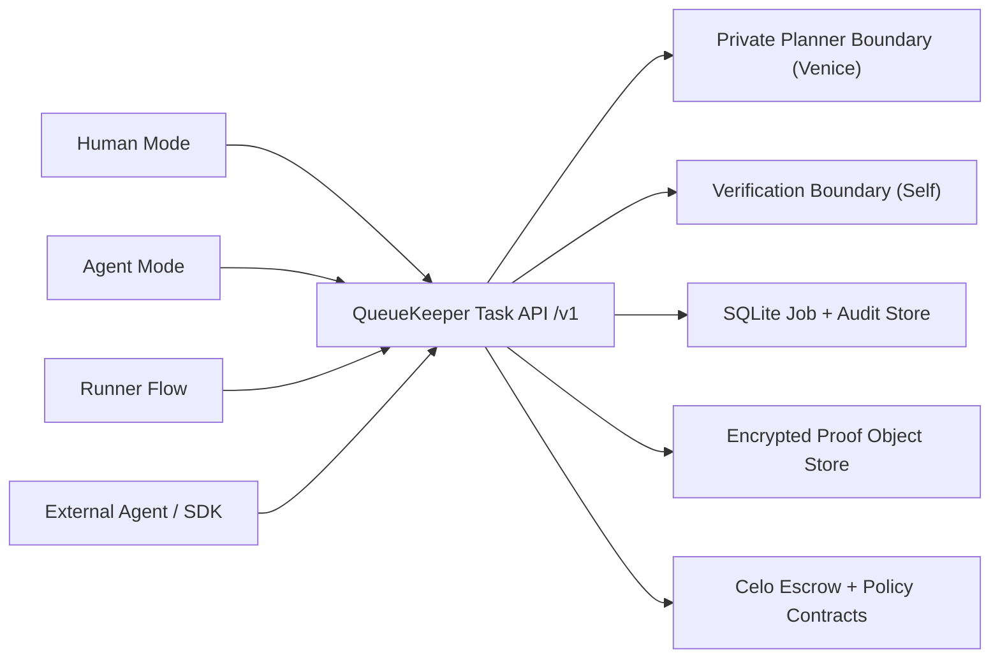

# QueueKeeper

QueueKeeper is a testnet-first private scout-and-hold procurement product: a human or agent principal can post a redacted task, reveal the exact destination only after verified acceptance, and pay only for the next verified increment instead of the whole promise.

## What is real now

- A durable core product layer lives in `packages/core`:
  - SQLite-backed job state and audit trail
  - encrypted secret payload storage
  - encrypted proof bundle storage
  - repeated heartbeat stages
  - timeout-based auto-release
  - dispute freeze and settlement
  - expiry refunds
  - idempotent draft creation
- A typed SDK lives in `packages/sdk`.
- `apps/agent` now exposes a real `/v1` headless API on top of the same core.
- `apps/web` exposes the same `/api/v1` API locally and uses the same planner/verification boundaries.
- Human Mode and Agent Mode now exist as distinct product entrypoints.
- The web UX is now task-first and operations-led:
  - homepage explains the bounded-trust procurement loop in one screen
  - `/agent` and `/human` create tasks against the same backend
  - `/tasks/[taskId]` acts as the principal command center
  - `/evidence` surfaces sponsor receipts and agent artifacts
- Exact destination remains encrypted at rest and only becomes visible to an accepted runner with a valid reveal token.
- Proof bundles can include encrypted image media, not just hashes.
- Planner output changes the actual stage plan:
  - `scout-only`
  - `scout-then-hold`
  - `hold-now`
  - `abort`
- The product supports both `DIRECT_DISPATCH` and `VERIFIED_POOL` modes at the schema/API layer.
- Root agent artifacts are available at `/agent.json` and `/agent_log.json`.
- A typed OpenAPI-style surface is exposed from the headless API at `/v1/openapi.json`.
- Foundry tests pass for the current escrow/policy contracts, and the new durable backend lifecycle tests pass in `packages/core`.

## Architecture



## Privacy model

- Public task envelope:
  - title
  - coarse area
  - rough timing window
  - visible payout schedule
  - verification requirement
  - job mode
- Secret payload:
  - exact destination
  - hidden notes
  - fallback instructions
  - sensitive buyer preferences
  - handoff secret
  - raw proof media
- Secrets are encrypted at rest.
- Public APIs and chain state only expose redacted metadata, hashes, references, and stage status.
- Buyer can review decrypted proof bundles inside the app.
- Accepted runner receives reveal data only through a verified acceptance token path.

## Headless API

The durable API surface is available in the agent app and mirrored locally in the web app:

- `POST /v1/tasks/drafts`
- `POST /v1/planner/preview`
- `POST /v1/tasks/:taskId/post`
- `POST /v1/tasks/:taskId/dispatch`
- `GET /v1/tasks`
- `GET /v1/tasks/:taskId`
- `POST /v1/tasks/:taskId/accept`
- `GET /v1/tasks/:taskId/reveal`
- `POST /v1/tasks/:taskId/proofs`
- `GET /v1/tasks/:taskId/proofs/:stageId`
- `POST /v1/tasks/:taskId/stages/:stageId/approve`
- `POST /v1/tasks/:taskId/stages/:stageId/dispute`
- `POST /v1/tasks/:taskId/stop`
- `POST /v1/tasks/:taskId/agent/decide`
- `GET /v1/tasks/:taskId/agent/log`
- `GET /v1/tasks/:taskId/timeline`
- `GET /v1/evidence`

## Delegation model

- Spend cap, expiry, token allowlist, contract allowlist, and job binding remain explicit.
- The UI only shows active MetaMask delegation after a real permission request succeeds.
- Backend state keeps the delegation record visible for buyer review and audit.

## Dispute and timeout model

- Runner submits encrypted proof bundle plus proof hash.
- Buyer can approve immediately.
- If the review timeout expires on low-risk stages, the backend auto-releases the stage.
- Buyer can dispute before release, which freezes the job into a dispute state.
- A buyer or configured arbiter token can settle a disputed stage to runner or refund.
- Expired jobs refund unreleased stages automatically.

## What is still simplified

- The durable backend is SQLite plus encrypted filesystem object storage, not a managed hosted database/blob stack yet.
- The contract layer now covers repeated heartbeats, auto-release, disputes, and expiry refunds, but the backend still owns:
  - encrypted proof media storage
  - buyer-side media review
  - reveal-token privacy boundaries
  - rich offchain receipts/timeline details
- Self is load-bearing for acceptance, but the repo still needs a full QR/deeplink proof-generation frontend for a polished live Self experience.
- Venice is live-capable and load-bearing when credentials and credits are available; it still falls back transparently when the provider is unavailable.
- `ProofHashRegistry` remains outside the active happy path.

## Repo layout

- `apps/web` — Next.js Human Mode, Agent Mode, runner flow, and sponsor evidence
- `apps/agent` — Node/TypeScript planner + verification service
- `contracts` — Foundry contracts + tests
- `packages/shared` — shared types, ABI, and deployed address exports
- `docs` — demo script, submission notes, and asset placeholders
- `WEBSITE` — landing page scaffold

## Quick start

### Prerequisites

- Node.js 22+
- pnpm 10+
- Foundry (`forge`, `anvil`)

### Install

```bash
pnpm install
```

### Run the web app

```bash
pnpm dev:web
```

### Run the headless API / agent service

```bash
pnpm dev:agent
```

### Validate

```bash
pnpm typecheck
pnpm lint
pnpm build
pnpm test
cd contracts && forge test -vv
```

## Environment

Copy and fill:

- `apps/web/.env.example`
- `apps/agent/.env.example`

Important defaults:

- Leave `NEXT_PUBLIC_AGENT_BASE_URL=` blank to use the built-in demo API routes.
- Set `NEXT_PUBLIC_QUEUEKEEPER_TOKEN_ADDRESS` if you want the optional live `createJob` path to target a different ERC-20 token.
- Set `NEXT_PUBLIC_CELO_RPC_URL` if you want live `viem` reads/writes to use a non-default RPC.
- Set `QUEUEKEEPER_ENCRYPTION_KEY` anywhere you deploy the durable API layer. Vercel should treat this as a required server-side secret.
- For a deployed app, add server-side Venice/Self envs in Vercel as well: `VENICE_API_KEY`, `VENICE_MODEL`, `SELF_MODE`, `SELF_API_URL`, `SELF_API_KEY`.

No secrets belong in git.

## Demo backend behavior

- Source of truth for durable task state: `packages/core`
- Headless API host: `apps/agent`
- Local mirrored API host: `apps/web/app/api/v1`
- Live planner status: the buyer preview shows `venice-live` vs `venice-fallback`
- Live Self status: runner acceptance now uses a QR/deeplink verification session flow when `SELF_MODE=live`

## Contracts and addresses

Source of truth for deployed addresses:

- `packages/shared/src/generated/addresses.ts`

Current exported addresses:

- Escrow: `0xb566298bf1c1afa55f0edc514b2f9d990c82f98c`
- Delegation policy: `0x8a1e766156d1107b99546c8d84f57f9dffd9bcb3`
- Proof registry: `0xc049de0d689bdf0186407a03708204c9e4199e49`

## Historical Celo Sepolia example

These historical links are useful for judges, but the local MVP does not depend on them:

- Mock token: `0xEeA30fA689535f7FB45a8A91045E3b1d1c54A3d6`
- Job creation tx: [0x921f3f8f461679644ce48aad265ba247a8ff313b849b36b409054eee0d5ac14a](https://celo-sepolia.blockscout.com/tx/0x921f3f8f461679644ce48aad265ba247a8ff313b849b36b409054eee0d5ac14a)
- Runner accept tx: [0x63937ce0fe97ddb716e46f3bf40f60fe5e236406f345d7fc758e4b6b26bc03d7](https://celo-sepolia.blockscout.com/tx/0x63937ce0fe97ddb716e46f3bf40f60fe5e236406f345d7fc758e4b6b26bc03d7)
- Proof submission tx: [0x6dc5de8167987e646f141b0f4b972a247df219c8bcead641d4bad9b02ac657b7](https://celo-sepolia.blockscout.com/tx/0x6dc5de8167987e646f141b0f4b972a247df219c8bcead641d4bad9b02ac657b7)
- Scout release tx: [0x391524f5123a3e77ec26f732a9239e3abaca6553704f03662f700edb72a01980](https://celo-sepolia.blockscout.com/tx/0x391524f5123a3e77ec26f732a9239e3abaca6553704f03662f700edb72a01980)

## Related docs

- `docs/DEMO-SCRIPT.md`
- `docs/DELIVERY_GAP.md`
- `docs/SUBMISSION_COPY.md`
- `docs/submission-metadata.template.json`
