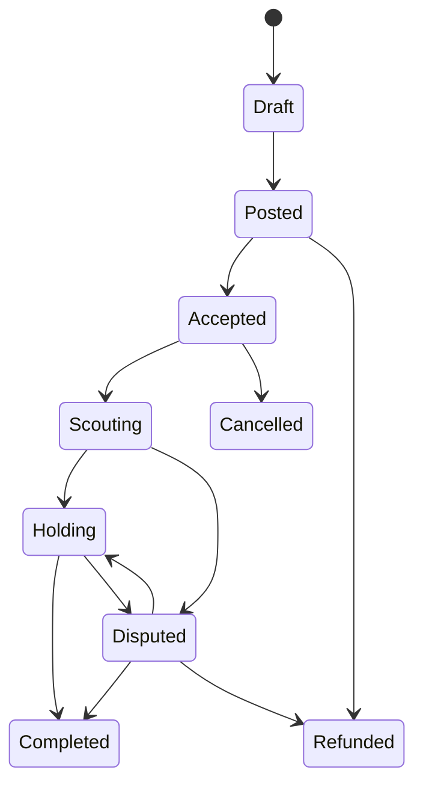

# QueueKeeper — SPEC.md

## 1. One-line product

QueueKeeper is a testnet-first private scout-and-hold procurement product: a human or agent principal can post a redacted task, reveal the exact destination only after verified acceptance, and pay only for the next verified increment instead of the whole promise.

## 2. What the repo currently ships

The shipped product is broader than a literal queue app, but narrower than a general labor marketplace.

Current framing:

- the flagship story is still scout-and-hold access procurement
- queue holding is the clearest demo case
- the actual product surface is task-first
- the same trust model can cover restaurant lines, merch lines, venue entry, pop-up openings, and short-lived in-person scouting tasks

This repo does **not** currently ship a broad multi-tenant gig marketplace. It ships a bounded-trust task system with private task payloads, staged releases, and a public board for unaccepted tasks.

## 3. Core thesis

Bound trust to the next verified increment.

Everything in the product should reinforce that:

- sensitive details stay private until acceptance
- acceptance is verification-gated
- payments move in stages
- the principal can stop after the current verified step
- the agent can recommend, but cannot exceed the spend boundary

## 4. Core actors

### Principal

The principal creates and funds a private task.

Current product modes:

- `HUMAN`
- `AGENT`

Human Mode and Agent Mode are separate entrypoints in the app, but they use the same underlying task model.

### Runner

The runner sees a redacted public brief, verifies, accepts, unlocks the reveal boundary, and submits the next proof-backed increment from a mobile-friendly flow.

### Agent

The agent is a first-class product actor, not a hidden backend detail.

Current agent surfaces:

- public `skill.md`
- `agent.json`
- `agent_log.json`
- `/agent` console for humans configuring or testing the same task flow visually
- `/v1` headless API in `apps/agent`

## 5. Core task modes

QueueKeeper currently supports two task assignment modes:

- `DIRECT_DISPATCH`
- `VERIFIED_POOL`

### `DIRECT_DISPATCH`

- the buyer can nominate a preferred runner address
- this is a preference, not an exclusive public-board lock
- posted direct-dispatch tasks still appear on the public `/tasks` board until someone accepts

### `VERIFIED_POOL`

- the task is intentionally open to verified runners
- it appears on the public `/tasks` board until acceptance

## 6. Public product surfaces

Current user-facing routes:

- `/`
- `/human`
- `/agent`
- `/tasks`
- `/tasks/[taskId]`
- `/runner/[jobId]`
- `/evidence`
- `/skill.md`
- `/agent.json`
- `/agent_log.json`

Legacy path:

- `/buyer` redirects to `/human`

What each route is for:

- `/`: public product shell, Human/Agent split, sponsor rails, public tasks
- `/human`: private task composer for human principals
- `/agent`: the same task composer with Agent Mode defaults and public handoff context
- `/tasks`: public earn board for posted, unaccepted tasks
- `/tasks/[taskId]`: command center for the task lifecycle
- `/runner/[jobId]`: mobile-first verify → accept → submit-proof flow
- `/evidence`: sponsor evidence grouped into core loop, agent infrastructure, and sidecars
- `/skill.md`: public machine-facing handoff

Current demo behavior:

- when the durable store is empty, the core seeds one posted `DIRECT_DISPATCH` task and one posted `VERIFIED_POOL` task so the public board always has a truthful demo surface
- the public board now has a separate durable `public_tasks` projection so the public `/tasks` page does not need to reconstruct listing state from private job rows
- if the live public board is empty or unavailable, the web UI may fall back to clearly labeled seeded demo rows instead of showing a dead-end empty state

## 7. Core loop

Current shipped happy path:

1. Principal previews the private planner.
2. Principal creates a private task draft.
3. Principal posts the task.
4. The posted task appears on the public board if it is still unaccepted.
5. Runner verifies and accepts the task.
6. Exact destination and private instructions unlock behind a reveal token.
7. Runner submits the next proof-backed stage.
8. Buyer approves, disputes, or waits for auto-release depending on the stage.
9. Buyer or agent decides whether to continue, stop, or let the next increment play out.

Important product rule:

- stop rights apply after the current verified increment, not before already-earned work

## 8. Public vs private data boundary

### Public task envelope

Current public-facing fields:

- title
- coarse area
- timing window
- visible payout ladder
- verification requirement
- task mode
- task status

### Private task payload

Current private fields:

- exact destination
- hidden notes
- fallback instructions
- sensitive buyer preferences
- handoff secret
- raw proof media

Current behavior:

- secrets are encrypted at rest in the core object store
- public task views expose redacted metadata only
- reveal happens only after verified acceptance and valid authorization
- proof media is stored offchain and only exposed to authorized buyers or accepted runners
- the public board can be served from a durable redacted projection without exposing private task rows directly

## 9. Planner boundary

The planner is load-bearing.

It currently decides one of:

- `scout-only`
- `scout-then-hold`
- `hold-now`
- `abort`

Current planner behavior:

- web and agent surfaces both use the same planner contract shape
- Venice can run live when configured
- deterministic fallback stays available and explicit when Venice is unavailable
- planner output changes the actual stage plan, not just copy

## 10. Verification boundary

Acceptance is verification-gated.

Current requirement:

- `SELF_VERIFIED`

Current behavior:

- mock verification is available for the hosted demo path
- live Self mode can create verification sessions
- runner acceptance remains blocked until verification succeeds
- successful acceptance returns a reveal token and unlocks the exact destination

## 11. Stage model

Current stage keys:

- `scout`
- `arrival`
- `heartbeat`
- `completion`

Current stage behavior:

- stages are generated from the planner action and payout ladder
- `scout-only` can omit hold/completion path stages
- `hold-now` can skip scout
- heartbeat can repeat for a configured count and cadence

Current default amounts when a caller omits the ladder:

- scout: 1
- arrival: 1
- heartbeat: 1
- completion: 2
- max budget: 5

## 12. Task lifecycle and statuses

Current task statuses in the shared model:

- `draft`
- `funded`
- `posted`
- `accepted`
- `scouting`
- `holding`
- `disputed`
- `completed`
- `expired`
- `refunded`
- `cancelled`

Current hosted flow uses `draft` then `posted` directly for the main in-app path. The `funded` wording still exists in the model and copy, but the durable hosted task flow is effectively draft -> post -> accept -> prove -> release.

### Stage statuses

Current stage statuses:

- `pending-proof`
- `submitted`
- `awaiting-release`
- `approved`
- `auto-released`
- `released`
- `disputed`
- `settled`
- `refunded`

### Practical lifecycle

Current status rules worth preserving:

- posted and unaccepted tasks appear on the public board
- accepted tasks leave the public board
- disputes freeze the task
- expiry refunds unreleased stages
- low-risk stages can auto-release after timeout
- the principal can stop the task after the current verified increment

## 13. Proof model

Current proof submission behavior:

- the runner submits a proof hash
- the runner can attach encrypted image media
- the bundle is stored offchain in the object store
- the buyer-visible review state is stored in the durable core
- proof and release transaction hashes can be attached when a live chain path is used

Only hashes and receipt references should be treated as onchain-grade artifacts. Raw proof media stays offchain.

## 14. Spend boundary and delegation

QueueKeeper still treats bounded spend as a core product concept.

Current shipped delegation behavior:

- each task stores a delegation policy record
- the policy captures spend cap, expiry, token allowlist, contract allowlist, and task binding
- the UI shows the boundary even when MetaMask permission capture is unavailable
- fallback policy recording is explicit instead of pretending a live delegation happened

Current delegation modes and statuses are part of the shared model and must stay accurate:

- modes:
  - `mock-bounded-policy`
  - `metamask-delegation`
- statuses:
  - `not-requested`
  - `requested`
  - `granted`
  - `rejected`
  - `mock-fallback`

## 15. Onchain boundary

The onchain happy path is real where it matters, but not every product detail is onchain.

Current chain role:

- staged escrow anchor
- delegation policy anchor
- proof-hash-ready surface
- tx receipts and explorer links where available

Current deployed contract set:

- `QueueKeeperEscrow.sol`
- `QueueKeeperDelegationPolicy.sol`
- `ProofHashRegistry.sol`

Current reality:

- escrow and delegation policy are the main active contract story
- `ProofHashRegistry` is deployed but not part of the active happy path
- the backend still owns encrypted proof media storage, reveal-token privacy boundaries, and richer receipt detail

## 16. Architecture

### Durable core

`packages/core` is the source of truth for task state.

Current responsibilities:

- SQLite-backed task state
- audit trail and timeline
- encrypted secret payload storage
- encrypted proof bundle storage
- planner-stage derivation
- status reconciliation
- disputes, auto-release, expiry refund, and stop semantics
- evidence and agent-log views

### SDK

`packages/sdk` exposes a typed client on top of the same core contract.

### API surfaces

- `apps/agent` exposes the real `/v1` headless API
- `apps/web/app/api/v1` mirrors the same API locally in the Next.js app

### Frontend

`apps/web` is the product UI:

- Human Mode
- Agent Mode
- public task board
- runner flow
- command center
- evidence page

### Static marketing scaffold

`WEBSITE/` exists as a scaffold, but the main product story is the Next.js app, not the static site.

## 17. Headless API contract

Current important routes:

- `POST /v1/planner/preview`
- `POST /v1/tasks/drafts`
- `POST /v1/tasks/:taskId/post`
- `POST /v1/tasks/:taskId/dispatch`
- `GET /v1/tasks`
- `GET /v1/tasks/:taskId`
- `POST /v1/tasks/:taskId/accept`
- `GET /v1/tasks/:taskId/reveal`
- `POST /v1/tasks/:taskId/proofs`
- `GET /v1/tasks/:taskId/proofs/:stageId`
- `POST /v1/tasks/:taskId/stages/:stageId/approve`
- `POST /v1/tasks/:taskId/stages/:stageId/dispute`
- `POST /v1/tasks/:taskId/stop`
- `POST /v1/tasks/:taskId/agent/decide`
- `GET /v1/tasks/:taskId/agent/log`
- `GET /v1/tasks/:taskId/timeline`
- `GET /v1/evidence`
- `POST /v1/uniswap/check-approval`
- `POST /v1/uniswap/quote`
- `POST /v1/uniswap/swap`
- `GET /v1/x402/venue-hint`

The current OpenAPI-style reference is part of the product:

- `/api/v1/openapi.json` in the web app
- equivalent `/v1/openapi.json` semantics in the headless agent service

## 18. Current user experience requirements

### Principal UX

The principal flow should feel like:

- define the public brief
- keep the sensitive payload private
- preview the planner
- pre-commit the payout ladder
- fund and post
- review the next increment
- stop or continue on purpose

### Runner UX

The runner flow should feel like:

- see the public brief
- verify
- accept
- unlock reveal
- submit the next proof
- see what gets paid next

The runner flow must remain mobile-friendly and action-first.

### Judge UX

Judges should understand quickly that:

- the product is private by default
- the task stays bounded by a spend policy
- acceptance is verification-gated
- the next proof unlocks the next payout
- the agent is visible and inspectable
- sponsor rails are real where shown

## 19. Sponsor rails in the current product story

### Core loop

- Venice: private planner boundary
- Self: verified acceptance gate
- MetaMask: bounded spend policy surface
- Celo: staged micropayment rail

### Agent infrastructure

- ERC-8004 / Synthesis identity surface
- `agent.json`
- `agent_log.json`
- optional ENS display data

### Sidecars

- Uniswap Sepolia budget normalization
- Base Sepolia x402 paid venue hint

These sidecars are real but secondary. They should strengthen the story without becoming the core product loop.

## 20. Current simplifications and honest gaps

Current honest simplifications:

- durable storage is SQLite plus encrypted filesystem object storage
- the backend still owns encrypted proof bundle handling and reveal-token enforcement
- live Self is available, but the UX polish for a fully smooth production-style Self flow is still limited
- Venice can fall back and must say so explicitly
- `ProofHashRegistry` is not on the active happy path
- the product is demo-grade, not a hardened multi-tenant production system

## 21. Non-goals

Do not drift this repo toward:

- generalized labor marketplace features
- generic creator dashboards
- rider/driver style logistics optimization
- long-term worker reputation marketplaces
- ticket-scalping or transfer-restricted queue abuse flows
- unrelated sponsor demos that weaken the scout-and-hold task loop

## 22. Demo requirements for the current repo

Meaningful work should preserve this end-to-end story:

1. principal enters through Human Mode or Agent Mode
2. principal creates and posts a private task
3. task appears on the public board if it is posted and unaccepted
4. runner verifies and accepts
5. exact destination unlocks only after acceptance
6. runner submits the next proof-backed increment
7. buyer approves, disputes, or auto-release handles the stage
8. receipts, agent artifacts, and evidence remain inspectable

## 23. Definition of alignment

When deciding what to build next, this repo should optimize for:

- the current task-first private procurement loop
- bounded trust and staged releases
- the visibility of the agent as a product actor
- honest sponsor evidence
- a crisp hosted demo over architectural purity

If code, copy, or flow changes make this spec false, update the spec in the same round.
