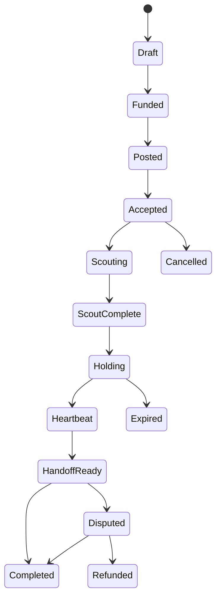

# QueueKeeper — SPEC.md

## 1. One-line product

**QueueKeeper** is a private procurement agent that lets a user hire a verified human to scout a queue, hold a place, and hand it off — with delegated spend controls, staged escrow, and redacted receipts.

## 2. Why this exists

Waiting in line is annoying, but the deeper problem is broader:

- users do not want to reveal their exact destination, item, budget, or timing too early,
- they do not trust labor platforms to enforce commitments fairly,
- they do not want to prepay a stranger in full,
- and they do not want their agent leaking metadata about what they are trying to buy or where they are going.

QueueKeeper solves this with:
- private agent reasoning,
- human-defined spend limits,
- verified human counterparties,
- staged onchain payments,
- and inspectable proof checkpoints.

## 3. Target user

Primary user:
- a crypto-native user attending a conference, launch, pop-up, or limited drop
- wants someone else to scout or hold a place in line
- wants privacy and payment control
- is willing to pay a small fee for time saved

Secondary user:
- a runner who wants simple, fast, mobile payouts for short real-world tasks

## 4. Hackathon positioning

### Primary narrative
**Private, delegated, escrowed queue procurement.**

### Best demo story
A user needs a place held at a pop-up / conference line.
Their AI agent:
1. reasons privately about max price and urgency,
2. finds a human-backed runner,
3. creates staged escrow,
4. pays a scout fee,
5. releases arrival + heartbeat + handoff payments as proofs arrive,
6. returns receipts and a clear audit trail.

### What judges should understand in 10 seconds
- there is a real human problem,
- crypto is enforcing the money and commitments,
- privacy is essential,
- the agent is useful but constrained,
- and the user stays in control.

## 5. Core sponsor / track strategy

### P0 tracks to optimize for
- Synthesis Open Track
- Venice
- MetaMask
- Self
- Arkhai
- Celo

### P1
- Lit
- Lido

## 6. Product principles

1. **Human stays in control**
 - the agent never gets uncapped spend
 - the user can always inspect or revoke the job

2. **Privacy by default**
 - do not reveal exact destination before acceptance
 - do not reveal max budget publicly
 - do not store raw proofs onchain

3. **Pay in stages**
 - scouting, arrival, heartbeat, handoff
 - never full prepayment to an untrusted counterparty

4. **Onchain where it matters**
 - permissions
 - escrow
 - payouts
 - proof hashes
 - audit trail

5. **Everything else can be offchain**
 - matching
 - UX
 - encrypted media delivery
 - LLM reasoning

## 7. Core use cases

### Use case A — conference merch line
User wants someone to hold a place in line for limited merch.

### Use case B — café / pop-up opening
User wants a scout to check queue length first, then only hold if it is worth it.

### Use case C — product drop / sample sale
User wants a runner to hold place until they arrive or until inventory is nearly sold out.

### Use case D — venue queue
User wants a human to confirm actual wait time before deciding whether to go.

## 8. Non-goals

Do **not** support in MVP:
- visa / immigration / medical / court queues
- identity-bound queues where place transfer is clearly impossible
- ticket scalping workflows
- long-term labor marketplace features
- global marketplace liquidity
- generalized gig economy tooling

## 9. Exact MVP scope

### Buyer side
- connect wallet
- create a job:
 - title
 - approximate area
 - exact destination (encrypted / hidden until acceptance)
 - max spend
 - scout fee
 - arrival fee
 - heartbeat fee
 - completion bonus
 - expiration time
 - optional notes
- sign a bounded delegation
- fund escrow
- monitor job status
- confirm handoff / completion
- see receipts and proof hashes

### Runner side
- connect wallet
- complete or present human verification
- browse available jobs with **redacted details**
- accept job
- receive exact location after acceptance
- submit:
 - scout proof
 - arrival proof
 - single heartbeat proof in the current MVP
 - completion proof
- receive payouts

### Agent side
- privately reason over user’s hidden preferences
- pick whether to:
 - scout only
 - scout then hold
 - abort
- choose acceptable runner
- create job-specific spend action(s)
- release stage payments only when proof conditions pass

## 10. State machine



## 11. Payment stages

### Stage 1 — scout
Small payment to verify the line exists and provide first ETA / photo proof.

### Stage 2 — arrival
Runner reaches the exact location and proves presence.

### Stage 3 — heartbeat
The current MVP ships a single heartbeat payout after valid presence proof.
Repeated heartbeat releases are a next-step extension, not an active claim.

### Stage 4 — handoff
Large final completion payment after user confirms takeover or after completion condition passes.

## 12. Why micropayments make sense here

Micropayments are **not** the whole product.
They are used where they reduce trust:

- tiny scout fee before the user commits,
- a heartbeat release while the runner is actively holding the spot,
- large final bonus only on handoff.

This minimizes exposure:
- the runner does not work for free for too long,
- the buyer does not prepay the full job to a stranger.

## 13. Track-by-track feature mapping

### Venice
The private planner sees:
- exact destination
- max budget
- user fallback rules
- timing sensitivity
- whether the user actually wants the item or only the line spot

The public chain sees:
- redacted job metadata
- delegation / escrow state
- proof hashes
- payments

### MetaMask
Use delegation as a **core** pattern:
- user -> buyer smart account delegation
- caveats:
 - max spend
 - expiration
 - only approved QueueKeeper contracts
 - only approved stablecoin
 - only approved function selectors
- optional job-specific sub-delegation

### Self
Runner cannot accept unless they present a valid human-backed proof.
Buyer can set policy:
- verified human only
- adult only (optional if supported)
- one active job per identity

### Arkhai
Use Alkahest-style staged escrow or extend it with:
- `ProofOfPresenceArbiter`
- `HeartbeatObligation`
- `HandoffConfirmationObligation`

### Celo
Use stablecoin-native low-fee payouts.
Runner UX should be mobile-first.

### Lit (optional)
Encrypt:
- exact destination
- handoff OTP / QR
- proof media
- buyer notes

### Lido (optional stretch)
Add a separate `YieldReserveAdapter`:
- owner deposits wstETH
- principal is never directly spendable by agent
- harvested / released yield can top up the queue budget
- **do not** let this stretch distract from the main demo

## 14. Technical architecture

## Frontend
- Next.js app
- buyer dashboard
- runner dashboard (mobile-friendly)
- static GitHub Pages marketing site in `/WEBSITE`

## Backend / agent
- Node / TypeScript service
- private planner using Venice-compatible API
- job orchestration
- proof validation
- event indexing
- optional encrypted payload relay

## Contracts
- `QueueKeeperEscrow.sol`
- `QueueKeeperRegistry.sol`
- `QueueKeeperDelegationPolicy.sol`
- `ProofHashRegistry.sol`
- `YieldReserveAdapter.sol` (optional stretch)

## Storage
- Postgres or SQLite for hackathon is fine
- only store encrypted or redacted sensitive details
- never store raw secrets in code or repo

## Chain
- Celo for core escrow / payouts
- Base only for hackathon identity (Synthesis registration)
- optional Base/Ethereum module for Lido stretch

## 15. Smart contract design

### 15.1 QueueKeeperEscrow.sol
Responsibilities:
- create jobs
- hold funds
- record stage transitions
- release stage payments
- refund on expiry
- emit clean events for receipts / UI

Key methods:
- `createJob(JobConfig config)`
- `acceptJob(uint256 jobId, bytes selfProofRef)`
- `submitProofHash(uint256 jobId, JobStage stage, bytes32 proofHash, string proofURI?)`
- `releaseStage(uint256 jobId, JobStage stage)`
- `completeJob(uint256 jobId, bytes32 handoffHash)`
- `cancelJob(uint256 jobId)`
- `refundJob(uint256 jobId)`

### 15.2 QueueKeeperDelegationPolicy.sol
Responsibilities:
- enforce spend rules
- validate caller / session key / delegate
- restrict token + contract + method usage

Possible caveats:
- max total spend
- max scout spend
- single heartbeat in the current MVP
- expiry timestamp
- stablecoin allowlist
- jobId binding
- one active job per delegation

### 15.3 ProofHashRegistry.sol
Responsibilities:
- future proof-hash mirror for the escrow flow
- stage metadata
- optional encrypted URI pointer
- keep onchain artifacts visible without exposing full media

Current MVP note:
- this registry is deployed but not wired into the active escrow flow yet

### 15.4 YieldReserveAdapter.sol (stretch)
Responsibilities:
- hold wstETH
- mark principal baseline
- compute excess / harvestable yield
- transfer only allowed yield to app treasury

## 16. Proof model

Proof data should be **hash-first**.

### Arrival proof
Payload:
- jobId
- stage
- timestamp
- runner address
- selfie or scene photo hash
- coarse location hash or manually entered challenge code
- optional signed statement

### Heartbeat proof
Payload:
- jobId
- timestamp
- short fresh photo hash or challenge phrase hash
- sequence number

### Handoff proof
Payload:
- jobId
- timestamp
- one-time handoff code hash
- optional buyer confirmation signature

Only hashes go onchain.
Raw data stays encrypted or offchain.

## 17. Privacy model

### Public
- job exists
- escrow funded
- runner accepted
- proof hashes submitted
- payments released

### Private
- exact location before acceptance
- buyer’s hidden max willingness to pay
- item / objective details
- raw proof photos
- handoff secret
- negotiation rationale

### Reveal policy
- pre-acceptance: coarse area only
- post-acceptance: exact location
- post-completion: buyer receives full proof bundle

## 18. Novelty / why this is not just a gig app

This is not a normal marketplace because:
- the **agent**, not the human, executes bounded procurement
- the **privacy model** is load-bearing
- the **delegation model** is load-bearing
- the **escrow stages** are onchain and inspectable
- the **identity proof** is privacy-preserving and human-backed
- the **runner is paid for verifiable progress**, not trust

## 19. UX requirements

### Buyer UX
Must feel like:
- “delegate a narrow errand”
- not “manage a protocol”

### Runner UX
Must feel like:
- “accept job”
- “prove you arrived”
- “get paid”
- “see next step”

### Judge UX
Must immediately see:
- sensitive details are hidden until necessary
- payments are bounded
- proofs unlock money
- receipts exist

## 20. Design requirements

- dark mode preferred
- mobile-first runner flow
- clean event timeline
- explorer links visible
- “what was kept private” card in the UI
- obvious spend cap / delegation display
- redacted receipts section

## 21. Demo requirements

Must show live:
1. buyer creates job
2. delegation requested or the bounded fallback policy record shown truthfully
3. escrow funded
4. runner accepted
5. scout or arrival proof submitted
6. stage payment released
7. single heartbeat / completion payout released
8. receipt timeline visible

Nice to show:
- hidden details before acceptance
- user cancels or blocks a too-expensive job
- Self verification badge
- explorer link for delegation + escrow tx

## 22. Acceptance criteria

### Product acceptance
- a user can create a job in under 2 minutes
- a runner can accept from mobile
- at least one live milestone payment happens onchain
- the app returns receipts and proof hashes

### Technical acceptance
- contracts are deployed
- public repo exists
- deployed frontend exists
- at least one working explorer link exists
- no secret keys in repo
- graceful fallback if Venice or Self are unavailable

### Judge acceptance
- demo is understandable in < 4 minutes
- sponsor integrations are clearly load-bearing
- the project is more than a CRUD marketplace

## 23. Fallback ladder if integrations get stuck

### If Self blocks you
Use a simple allowlisted runner demo, but keep the verification interface and note Self as planned integration.

### If Arkhai blocks you
Ship your own staged escrow contract with a `ProofOfPresenceArbiter` interface.
Do not wait on deep protocol integration if it blocks shipping.

### If MetaMask delegation blocks you
Ship a simpler bounded smart-account or signed policy flow, but keep the UI and contract interfaces compatible.

### If Venice blocks you
Run the private planner locally / server-side and clearly separate private vs public data.

### If Lit blocks you
Use encrypted server-side storage and explicit reveal steps.

### If Lido blocks you
Drop the yield adapter entirely.
It is a stretch, not core.

## 24. Repo layout

```text
queuekeeper/
 apps/
 web/ # buyer + runner UI
 agent/ # orchestration + Venice planner + webhook/indexer
 contracts/
 src/
 test/
 script/
 packages/
 shared/ # types, ABIs, helpers
 docs/
 SPEC.md
 PRIZE-STRATEGY.md
 DEMO-SCRIPT.md
 WEBSITE/
 index.html
 styles.css
```

## 25. Suggested stack

- Next.js
- TypeScript
- viem
- wagmi
- Foundry
- RainbowKit or MetaMask SDK
- Venice-compatible client
- Self SDK / MCP / verification API
- Celo RPC
- optional Lit SDK

## 26. What to ship by hackathon deadline

### Must ship
- public repo
- deployed frontend
- deployed escrow contract
- at least one real onchain payout
- screen-recorded demo
- GitHub Pages landing page
- submission copy and screenshots

### Do not miss
- Synthesis conversation log
- exact track selection
- cover image
- explorer links
- one clean sentence that judges remember

## 27. The sentence to repeat

> QueueKeeper lets a user privately hire a verified human to scout and hold a place in line, while their agent pays only as onchain proofs arrive.
